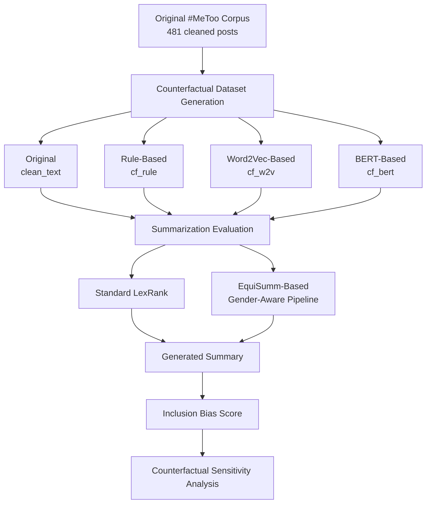
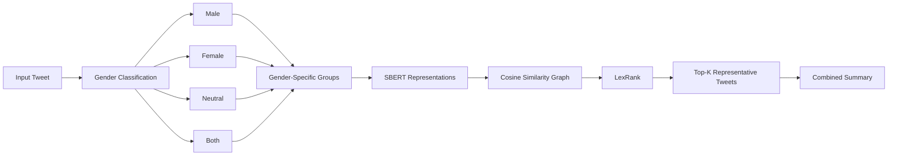
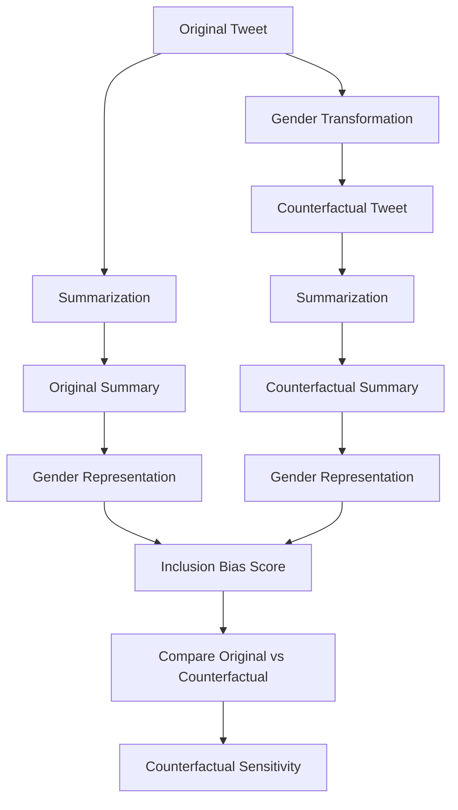
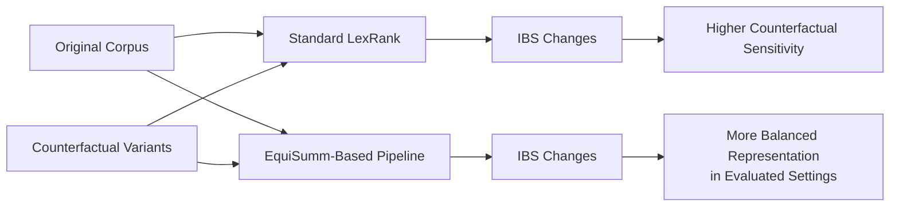
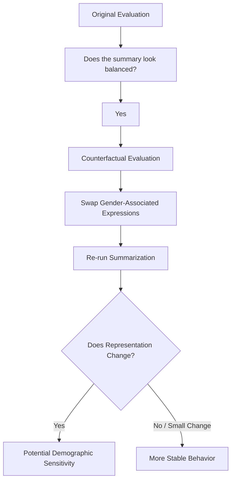
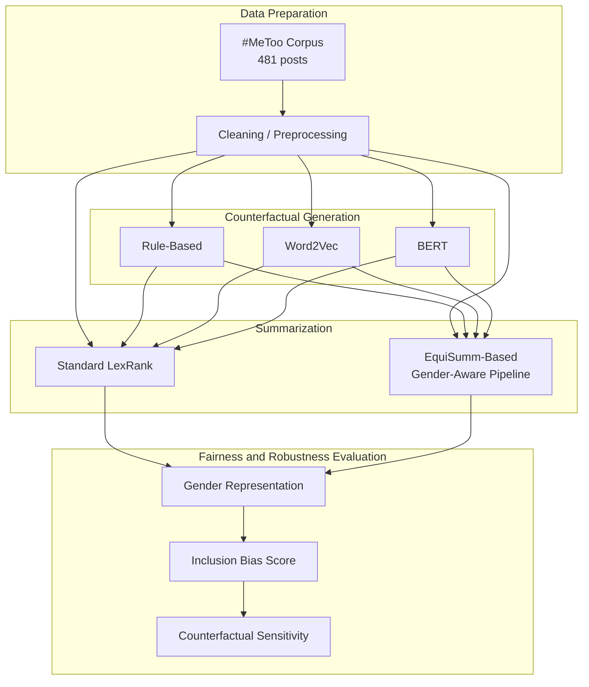
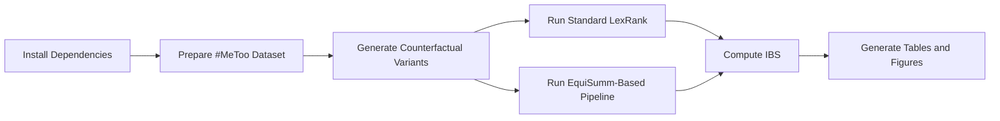
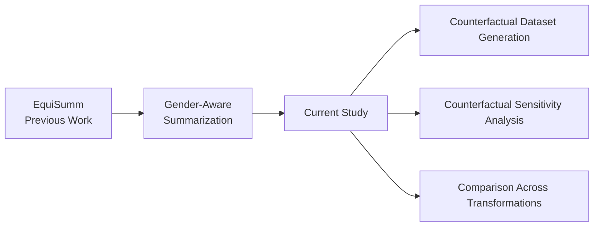

# Counterfactual Evaluation and Mitigation of
Gender Bias in Tweet Summarization

This repository contains the research artifacts for **Counterfactual-Aware Inclusive Summarization**, a study of demographic sensitivity and gender-related inclusion bias in extractive social-media summarization.

The work evaluates whether a summarization system changes its gender representation when gender-associated expressions are counterfactually modified while the underlying social-media content remains comparable. The study uses the **EquiSumm gender-aware summarization pipeline** as the underlying demographic-aware framework and evaluates it against standard LexRank across original and counterfactual datasets.


---

## Overview

Automated summarization can make large social-media discussions easier to understand, but conventional extractive methods may unintentionally amplify demographic representation imbalances.

This project studies that problem through **counterfactual evaluation**:

1. Start with an original `#MeToo` social-media corpus.
2. Generate counterfactual versions by modifying gender-associated expressions.
3. Apply the same summarization pipeline to the original and transformed datasets.
4. Measure gender representation using the **Inclusion Bias Score (IBS)**.
5. Compare conventional **LexRank** with the **EquiSumm-based gender-aware pipeline**.
6. Analyze whether the summarization behavior changes when gender terminology changes.

The central research question is:

> **Does a summarization system remain stable and balanced when gender-associated expressions are counterfactually modified?**

---

## Key Findings

The evaluation uses 481 cleaned `#MeToo` social-media posts and three counterfactual variants:

| Dataset | Standard LexRank | EquiSumm-based Gender+LexRank |
|---|---:|---:|
| `clean_text` | +0.3125 | +0.1500 |
| `cf_rule` | -0.3750 | -0.0244 |
| `cf_w2v` | -0.3939 | -0.0909 |
| `cf_bert` | -0.3125 | +0.2195 |

### Main observations

- Standard LexRank changes substantially across counterfactual variants.
- Its Inclusion Bias Score changes from **+0.3125** on the original corpus to **-0.3750** and **-0.3939** on the rule-based and Word2Vec variants.
- The direction of the observed bias can therefore change after gender-associated expressions are modified.
- The EquiSumm-based gender-aware pipeline produces a more balanced score on the original corpus: **+0.1500**.
- On the rule-based counterfactual corpus, the gender-aware pipeline reaches **-0.0244**, which is close to demographic neutrality.
- These preliminary results suggest that demographic stratification can reduce the influence of demographic terminology during summary selection.

---

## Results Visualization

The following figure summarizes the Inclusion Bias Score comparison.


**Interpretation:** Scores closer to zero indicate more balanced representation. Standard LexRank exhibits large changes across counterfactual transformations, while the EquiSumm-based gender-aware pipeline remains closer to zero for the evaluated rule-based and Word2Vec variants.

---

## Research Pipeline



---

# Methodology

## 1. Counterfactual Dataset Construction

Let the original dataset be:

$$
D = \{s_1, s_2, \ldots, s_n\}
$$

A counterfactual dataset is generated using a gender transformation function:

$$
D' = \{f_{\mathrm{swap}}(s_1), \ldots, f_{\mathrm{swap}}(s_n)\}
$$

The project evaluates three transformation strategies.

### Rule-Based Transformation

The `cf_rule` variant uses predefined gender-associated terms and directly swaps gendered expressions.

Examples include transformations such as:

```text
she  -> he
woman -> man
her  -> his
```

The purpose is to provide a deterministic counterfactual condition.

### Word2Vec-Based Transformation

The `cf_w2v` variant uses Word2Vec representations to identify semantically related gender-associated terms and perform distributed semantic substitutions.

This tests whether summarization behavior changes under transformations that are less dependent on direct dictionary matching.

### BERT-Based Transformation

The `cf_bert` variant uses contextual BERT-based transformations to modify gender-associated expressions while considering surrounding textual context.

This provides a context-aware counterfactual setting.

---

## 2. EquiSumm-Based Gender-Aware Summarization

The demographic-aware component is based on the previously developed **EquiSumm** framework.

EquiSumm contains two major phases:



### Phase I: Gender Classification

Tweets are classified according to the gender-associated aspect discussed in the text:

- `Male`
- `Female`
- `Neutral`
- `Both`

The classification does **not** infer the gender identity of the user who posted the tweet. Instead, it identifies the gender-associated aspect referred to or discussed within the tweet.

The classification combines:

- Gender-associated vocabulary
- spaCy NER
- SBERT representations
- Gender-group centroids
- Cosine similarity

### Phase II: Representative Tweet Selection

Tweets within each gender-associated group are represented using Sentence-BERT embeddings.

A similarity graph is constructed using cosine similarity. LexRank is then applied to identify the most central and representative tweets within each group.

The top-\(K\) tweets from each group are selected and combined to form the final summary.

This stratification reduces the possibility that a numerically dominant demographic group controls the entire summary.

---

# Counterfactual Evaluation

The core idea of the evaluation is to compare summarization behavior before and after counterfactual transformations.



A counterfactually stable summarization system should ideally maintain similar important content and representation after gender-associated expressions are modified.

Formally, if \(I(D)\) denotes the indices of selected tweets:

\[
I(D) \approx I(D')
\]

Large changes suggest that the summarizer may be responding to demographic terminology rather than only to the underlying semantic salience of the content.

---

# Inclusion Bias Score

The project uses the **Inclusion Bias Score (IBS)** introduced in EquiSumm.

$$
\mathrm{IBS} =
\frac{\sum_j freq(f_j)}
{\sum_i freq(m_i) + \sum_j freq(f_j)}
-
\frac{\sum_i freq(m_i)}
{\sum_i freq(m_i) + \sum_j freq(f_j)}
$$

where:

- $freq(m_i)$ = frequency of male-associated terms
- $freq(f_j)$ = frequency of female-associated terms
where:

- \(freq(m_i)\) = frequency of male-associated terms
- \(freq(f_j)\) = frequency of female-associated terms

### Interpretation

| IBS | Interpretation |
|---:|---|
| Near 0 | Balanced representation |
| Positive | Higher female-associated representation |
| Negative | Higher male-associated representation |

The metric allows demographic representation to be evaluated without requiring a human-written reference summary.

---

# Dataset Variants

| Variant | Generation Method | Purpose |
|---|---|---|
| `clean_text` | Original corpus | Baseline evaluation |
| `cf_rule` | Rule-based gender swapping | Deterministic counterfactual evaluation |
| `cf_w2v` | Word2Vec-based replacement | Distributed semantic transformation |
| `cf_bert` | Contextual BERT-based swapping | Context-aware transformation |

The evaluation corpus contains **481 cleaned `#MeToo` posts**.

---

# Experimental Results

## Standard LexRank

| Dataset | Male Mentions | Female Mentions | Male Score | Female Score | IBS | Direction |
|---|---:|---:|---:|---:|---:|:---:|
| `clean_text` | 11 | 21 | 0.3438 | 0.6562 | +0.3125 | F |
| `cf_rule` | 22 | 10 | 0.6875 | 0.3125 | -0.3750 | M |
| `cf_w2v` | 23 | 10 | 0.6970 | 0.3030 | -0.3939 | M |
| `cf_bert` | 21 | 11 | 0.6562 | 0.3438 | -0.3125 | M |

## EquiSumm-Based Gender+LexRank

| Dataset | Male Mentions | Female Mentions | Male Score | Female Score | IBS | Direction |
|---|---:|---:|---:|---:|---:|:---:|
| `clean_text` | 17 | 23 | 0.4250 | 0.5750 | +0.1500 | F |
| `cf_rule` | 21 | 20 | 0.5122 | 0.4878 | -0.0244 | M |
| `cf_w2v` | 18 | 15 | 0.5455 | 0.4545 | -0.0909 | M |
| `cf_bert` | 16 | 25 | 0.3902 | 0.6098 | +0.2195 | F |

### Results Flow



---

# Why Counterfactual Evaluation Matters

A summarizer may appear fair when evaluated only on the original dataset. However, that evaluation does not reveal whether the system's behavior depends strongly on demographic terminology.

Counterfactual testing provides an additional robustness check:



This makes counterfactual evaluation complementary to conventional fairness evaluation rather than a replacement for it.

---

# Key Contributions

This study focuses on the following contributions:

1. **Counterfactual evaluation framework** for studying demographic sensitivity in extractive social-media summarization.
2. **Three counterfactual transformation strategies** based on rule-based, Word2Vec, and BERT-based gender-associated substitutions.
3. **Evaluation of the EquiSumm pipeline under counterfactual transformations**, rather than introducing a separate gender classification mechanism.
4. **Quantitative analysis using Inclusion Bias Score** to measure changes in gender representation.
5. **Comparison with standard LexRank** to examine whether demographic-aware summarization produces more balanced behavior.

---

# Research Architecture



---

# Project Structure

A recommended repository structure is:

```text
.
├── README.md
├── data/
│   ├── README.md
│   └── ...
├── src/
│   ├── preprocessing/
│   ├── counterfactual/
│   ├── gender_classification/
│   ├── summarization/
│   └── evaluation/
├── notebooks/
│   └── ...
├── results/
│   ├── tables/
│   └── figures/
├── assets/
│   └── inclusion_bias_comparison.png
├── paper/
│   └── paper.pdf
└── requirements.txt
```

The exact directory structure should be updated to match the implementation in the repository.

---

# Reproducibility

The experimental workflow can be summarized as:


---

# Technologies

The research pipeline uses or builds upon:

- Python
- Natural Language Processing
- Sentence-BERT (SBERT)
- spaCy NER
- Word2Vec
- BERT
- FAISS / vector-based semantic processing where applicable
- LexRank
- Cosine similarity
- Graph-based extractive summarization
- Counterfactual evaluation

---

# Research Relationship to EquiSumm

This project should be viewed as a **counterfactual evaluation and robustness study built around the EquiSumm framework**.

The distinction is important:



**EquiSumm** establishes the gender-aware summarization framework and the Inclusion Bias Score. This study uses that framework to investigate how summarization behavior changes under counterfactual gender transformations.

---

# Limitations

The current evaluation has several limitations:

- The experiments use a single `#MeToo` social-media corpus.
- The counterfactual transformations focus on gender-associated expressions.
- The current evaluation does not establish generalization across all social-media domains.
- The evaluation of demographic fairness is currently centered on the Inclusion Bias Score.
- The current study does not provide a comprehensive treatment of non-binary or intersectional demographic identities.

These limitations motivate the future work described below.

---

# Future Work

Future directions include:

1. Evaluating the framework on larger and more diverse social-media datasets.
2. Exploring additional counterfactual generation strategies.
3. Evaluating other summarization architectures beyond LexRank.
4. Extending fairness evaluation to non-binary demographic representations.
5. Studying intersectional demographic representation.
6. Combining counterfactual robustness with additional human and automatic evaluation measures.


# Authors

**Chaitanya Wanjari**  
ABV-IIITM Gwalior

**Jessica Kamal**  
ABV-IIITM Gwalior

**Riddhi Jain**  
ABV-IIITM Gwalior

**Samruddhi Kurhe**  
ABV-IIITM Gwalior

**Roshni Chakraborty**  
ABV-IIITM Gwalior

---

## Research Summary

```text
Counterfactual Gender Transformation
                |
                v
        Original / CF Datasets
                |
                v
     +-------------------------+
     |                         |
     v                         v
Standard LexRank       EquiSumm-Based Pipeline
     |                         |
     +------------+------------+
                  |
                  v
       Inclusion Bias Score
                  |
                  v
    Counterfactual Sensitivity
                  |
                  v
     Fairness + Robustness
        Analysis
```

The central finding of this study is that **counterfactual testing exposes substantial changes in gender representation in standard LexRank, while the EquiSumm-based gender-aware pipeline produces more balanced representation in the evaluated settings**.
